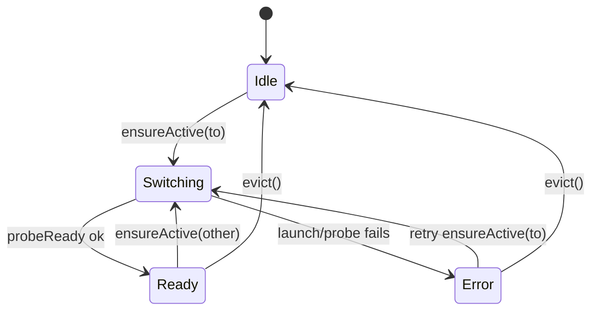

<!-- CRITICAL -->
# Controller RFC: Inference Engine Connectors, Lifecycle Reliability, and Runtime Discovery

**Status:** Phase 1 implemented (Feb 22, 2026); Phase 2+ pending  
**Scope:** `controller/` module (Bun + Hono + SQLite)  
**Primary focus:** inference lifecycle + connectors + runtime/version reporting

## Executive Summary

The controller is already a credible foundation: it has a dependency container (`controller/src/app-context.ts`), modular route registration (`controller/src/http/app.ts`), SQLite persistence for recipes (`controller/src/modules/lifecycle/recipes/recipe-store.ts`), and a real-time observability spine (SSE via `controller/src/modules/monitoring/event-manager.ts`, Prometheus metrics via `controller/src/modules/monitoring/metrics.ts`, plus a background collector in `controller/src/modules/lifecycle/metrics/metrics-collector.ts`).

The main historical reliability issue was **missing a single, authoritative lifecycle coordinator**. Model switching was initiated from multiple codepaths with **independent locks** (explicit lifecycle routes vs OpenAI proxy), creating race windows and stale/contradictory state.

**Phase 1 is now implemented** via a single coordinator (`controller/src/modules/lifecycle/state/lifecycle-coordinator.ts`) used by both `POST /launch/:recipeId` and `POST /v1/chat/completions`, plus a lifecycle module restructure into subdirectories to reduce file sprawl.

This RFC proposes a professionalized architecture centered on:

1. **Engine connectors** (typed interfaces + per-backend implementations)
2. **A single lifecycle coordinator** (one lock, one state machine, idempotent switching)
3. **A unified runtime discovery/version surface** (API + SSE + optional persistence)
4. **Testable contracts** (integration tests for switch correctness + concurrency)
5. **Complexity reduction** (delete duplicated switching logic; shrink route handlers; single-source lifecycle behavior)

## Goals (Vision → Controller Responsibilities)

Your vision implies the controller must reliably provide:

1. **Connectors**
   - Backends: `vllm`, `sglang`, `llama.cpp`, `exllamav3` (and future engines)
   - Each connector knows: how to launch, how to detect a running process, how to probe readiness, how to report version/installation state.
2. **Lifecycle orchestration**
   - `/v1/chat/completions` (and other OpenAI-ish endpoints) can trigger mount/swap.
   - A request for model A must deterministically ensure A is active, preempting B when necessary.
3. **GPU + platform visibility**
   - CUDA vs ROCm detection, GPU telemetry, and “what’s installed” reporting.
4. **Professional API**
   - A coherent set of endpoints and SSE events that expose:
     - active model/engine
     - switch state/progress
     - versions/install status
     - compatibility report + actionable fixes
5. **Reduced complexity + fewer lines of code**
   - Eliminate duplicated “switch pipelines” across routes.
   - Keep Hono route handlers thin; move orchestration into one coordinator.
   - Make per-engine differences live in connectors, not scattered conditionals.

## Non-Goals (for this RFC / current milestone)

- Implementing new engines or rewriting everything immediately.
- Building a full package manager for runtimes (this RFC outlines an interface to add later).
- Changing frontend contracts right now (keep output additive/incremental).

## Current Architecture (As-Built)

### Runtime entry + DI container

- `controller/src/main.ts`: starts Bun server; checks `nvidia-smi`; starts metrics collector.
- `controller/src/app-context.ts`: constructs `AppContext` (config, logger, event manager, stores, process manager, etc.).
- `controller/src/http/app.ts`: registers route modules + OpenAPI docs endpoints.

### Key modules relevant to “controller as inference orchestrator”

- Lifecycle + runtime:
  - `controller/src/modules/lifecycle/routes/lifecycle-routes.ts` (`/recipes`, `/launch`, `/evict`, `/wait-ready`)
  - `controller/src/modules/lifecycle/state/lifecycle-coordinator.ts` (single-writer switching + readiness polling)
  - `controller/src/modules/lifecycle/process/process-manager.ts` (spawn/kill/find running inference)
  - `controller/src/modules/lifecycle/engines/backends.ts` (backend-specific command builders)
  - `controller/src/modules/lifecycle/runtime/runtime-info.ts` + `controller/src/modules/lifecycle/routes/runtime-routes.ts` (version/install detection + upgrades)
  - `controller/src/modules/lifecycle/routes/system-routes.ts` (`/health`, `/status`, `/gpus`, `/compat`, `/config`)
- OpenAI-compatible routing:
  - `controller/src/modules/proxy/openai-routes.ts` (`POST /v1/chat/completions` + model switching)
  - `controller/src/modules/models/routes.ts` (`GET /v1/models` list from recipes + active model)
- Observability:
  - `controller/src/modules/monitoring/event-manager.ts` (SSE event bus)
  - `controller/src/modules/monitoring/logs-routes.ts` (`/events`, `/logs`, streaming)
  - `controller/src/modules/monitoring/metrics-routes.ts` (`/metrics`, `/benchmark`, `/peak-metrics`, `/lifetime-metrics`)
  - `controller/src/modules/lifecycle/metrics/metrics-collector.ts` (5s loop: status/gpu/metrics/runtime_summary)

### Current route inventory (reproducible extraction)

You can regenerate the route list with:

```bash
rg -n 'app\\.(get|post|put|delete)\\(\"' controller/src \
  | sed -E 's#^([^:]+):([0-9]+):.*app\\.(get|post|put|delete)\\(\"([^\"]+)\".*#\\3\\t\\4\\t\\1:\\2#' \
  | sort
```

This shows that inference lifecycle can be driven by both:

- explicit lifecycle endpoints (e.g. `POST /launch/:recipeId` in `controller/src/modules/lifecycle/routes/lifecycle-routes.ts`)
- implicit OpenAI switching (e.g. `POST /v1/chat/completions` in `controller/src/modules/proxy/openai-routes.ts`)

## Complexity & LOC Snapshot (Where to Reduce)

This controller is ~**20,872** TypeScript/TSX lines under `controller/src` (observed **Feb 22, 2026**).

Reproduce the “largest files” list with:

```bash
find controller/src -type f \( -name '*.ts' -o -name '*.tsx' \) -print0 \
  | xargs -0 wc -l \
  | sort -nr \
  | head -n 30
```

The largest *inference orchestration* hotspots are:

- `controller/src/modules/lifecycle/engines/backends.ts` (~505 LOC): backend-specific argv/env building
- `controller/src/modules/lifecycle/process/process-manager.ts` (~365 LOC): spawn/kill/find inference processes
- `controller/src/modules/lifecycle/routes/lifecycle-routes.ts` (~371 LOC): explicit launch/evict + status endpoints
- `controller/src/modules/proxy/openai-routes.ts` (~319 LOC): OpenAI proxy + implicit switch path
- `controller/src/modules/lifecycle/routes/system-routes.ts` (~368 LOC): status/compat/runtime aggregation + `/health` polling
- `controller/src/modules/lifecycle/process/process-utilities.ts` (~309 LOC): process probing helpers
- `controller/src/modules/lifecycle/runtime/runtime-info.ts` (~267 LOC): runtime/version detection and summary

**Complexity thesis:** to reduce lines *and* improve reliability, we should delete duplicated orchestration logic first (switch locking, evict/launch/probe loops), then consolidate per-engine variance behind connectors so fewer routes need backend conditionals.

## Lifecycle Switching (Centralized in Phase 1)

There are still two *entrypoints* that can cause a model to become active:

- `POST /launch/:recipeId` in `controller/src/modules/lifecycle/routes/lifecycle-routes.ts`
- `POST /v1/chat/completions` in `controller/src/modules/proxy/openai-routes.ts`

But both call into a single coordinator:

- `controller/src/modules/lifecycle/state/lifecycle-coordinator.ts`

This coordinator owns:

- the single switch lock (`AsyncLock`)
- eviction + launch + readiness probing
- consistent SSE events (`launch_progress` for explicit launches, `model_switch` for implicit switches)
- consistent `launchState` updates so `/status` and `/recipes` can accurately reflect “starting”

## Key Findings (Updated Post-Phase 1)

### Baseline Build Health (observed Feb 22, 2026)

- `bun test` passes (77 tests across 18 files).
- `npx tsc --noEmit` passes (clean typecheck baseline).

### Finding 1 (Resolved): Multiple locks / switching entrypoints racing

Fix:
- Switching now funnels through `controller/src/modules/lifecycle/state/lifecycle-coordinator.ts` (single lock), used by:
  - `controller/src/modules/lifecycle/routes/lifecycle-routes.ts` (`POST /launch/:recipeId`, `POST /evict`)
  - `controller/src/modules/proxy/openai-routes.ts` (`POST /v1/chat/completions`)

### Finding 2 (Partially Resolved): “Launching” state incomplete

Fix:
- The coordinator updates `launchState` for both explicit launches and implicit OpenAI-triggered switches.

Remaining gap:
- `launchState` is still an in-memory “current launching recipe id” and does not provide a full lifecycle read-model (stage, from→to, correlation id, timestamps).

### Finding 3 (Resolved): `python -m ...` mis-parsed as model path

Fix:
- `controller/src/modules/lifecycle/process/process-manager.ts` only treats `-m` as model path for backends where it is a model flag (e.g. `llamacpp`, `exllamav3`), avoiding `python -m vllm...` false matches.

### Finding 4 (Open): Readiness probing still isn’t connector-defined

Fix:
- Readiness probing is now centralized (coordinator) instead of duplicated across routes.

Remaining gap:
- The probe is still effectively “poll `/health`”; connector-defined probes are the next professionalization step.

### Finding 5 (Open): Switching correctness/concurrency tests are still thin

Remaining gap:
- Add integration tests that simulate “A → B → A” thrash and concurrent requests to verify coordinator guarantees.

## Proposed Target Architecture (Professionalization)

### 1) Engine Connector Interface

Add a first-class connector interface (shape, not code yet) that every engine implements:

```ts
interface InferenceEngineConnector {
  readonly id: Backend; // "vllm" | "sglang" | "llamacpp" | "exllamav3" | ...

  detectRuntime(config: Config): Promise<RuntimeBackendInfo>; // version/install/path
  buildLaunch(recipe: Recipe, config: Config): { argv: string[]; env: Record<string, string> };
  parseProcess(proc: { pid: number; args: string[] }, config: Config): ProcessInfo | null;
  probeReady(config: Config, port: number): Promise<{ ready: boolean; reason?: string }>;
  supportsOpenAI: boolean;
}
```

This folds today’s scattered responsibilities across:
- `controller/src/modules/lifecycle/engines/backends.ts` (launch argv)
- `controller/src/modules/lifecycle/runtime/runtime-info.ts` (detect runtime)
- `controller/src/modules/lifecycle/process/process-manager.ts` + `controller/src/modules/lifecycle/process/process-utilities.ts` (parse running process)
- centralized readiness probing in `controller/src/modules/lifecycle/state/lifecycle-coordinator.ts` (routes delegate here)

### 2) Single Lifecycle Coordinator (One lock, one state machine)

Create a single coordinator (conceptually) owned by `AppContext` so every entrypoint uses the same gate:

- Serializes all switching (evict/launch/probe) across all routes.
- Provides a single “truth” state:
  - active recipe/process
  - switching in progress (from → to)
  - last error
  - timestamps and durations

Suggested states:



### 3) Unified Runtime/Version Surface

Today you already have good primitives:
- `GET /runtime/*` endpoints (`controller/src/modules/lifecycle/routes/runtime-routes.ts`)
- `GET /config` includes `runtime` (`controller/src/modules/lifecycle/routes/system-routes.ts`)
- periodic SSE `runtime_summary` (`controller/src/modules/lifecycle/metrics/metrics-collector.ts`)

Make this “professional” by:

- Defining a stable response schema (types already exist in `controller/src/modules/lifecycle/types.ts`)
- Adding a single “read model” endpoint for clients:
  - `GET /v1/system/runtime` (or keep existing and standardize names)
- Optionally persisting runtime snapshots (useful for debugging upgrades and “it broke after update” narratives)

### 4) API Contract for Lifecycle (Idempotent + Observable)

Target invariants:

- **Idempotency:** requesting model A when A is already active must be a no-op.
- **Single-writer:** at most one switch executes at a time per inference port.
- **Observable:** clients can subscribe to switch progress and final status.

Proposed API additions (additive; keep old routes for now):

- `GET /v1/system/status` → includes `active_recipe_id`, `switching`, `last_error`, `since`
- `POST /v1/system/switch` `{ recipe_id }` → explicit switch that uses the same coordinator as OpenAI paths
- SSE event: `lifecycle` with `{ from, to, stage, progress, reason, correlation_id }`

## Top 10 Fixes / Tickets (Prioritized Backlog)

1. ✅ **Unify lifecycle locking across all switching entrypoints** (Done: Feb 22, 2026)
   - Files: `controller/src/modules/lifecycle/state/lifecycle-coordinator.ts`, `controller/src/modules/lifecycle/routes/lifecycle-routes.ts`, `controller/src/modules/proxy/openai-routes.ts`, `controller/src/app-context.ts`
   - Acceptance: `/launch`, `/evict`, and `/v1/chat/completions` cannot execute overlapping evict/launch operations.
   - Complexity/LOC win: delete duplicated lock+switch pipeline across routes; route handlers become thin wrappers around one coordinator method.

2. ✅ **Fix `findInferenceProcess` model path parsing for `python -m ...`** (Done: Feb 22, 2026)
   - Files: `controller/src/modules/lifecycle/process/process-manager.ts`
   - Acceptance: active model is correctly detected for both `vllm serve <model>` and `python -m vllm.entrypoints... --model <model>` styles.
   - Complexity/LOC win: reduces “mystery switch” loops that force extra compensating logic elsewhere (retries, overrides, user-facing “false errors”).

3. **Make readiness probing connector-defined**
   - Files: `controller/src/modules/lifecycle/state/lifecycle-coordinator.ts`, new connector layer
   - Acceptance: each backend uses a probe that matches its real capabilities; no hard-coded `/health` assumption everywhere.
   - Complexity/LOC win: remove repeated `/health` polling loops by routing through one connector probe API.

4. **Centralize and persist lifecycle state**
   - Files: `controller/src/modules/lifecycle/state/launch-state.ts`, `controller/src/modules/lifecycle/routes/system-routes.ts`, SSE events in `controller/src/modules/monitoring/event-manager.ts`
   - Acceptance: `/status` reports switching state for *all* switch types; optional persistence enables post-mortem.
   - Complexity/LOC win: eliminate route-scoped “launching” flags and ad-hoc state checks spread across endpoints; one state object feeds all read APIs + events.

5. **Add integration tests for model switching (including concurrency)**
   - Files: new tests under `controller/src/modules/lifecycle/` or `controller/src/tests/`
   - Acceptance: automated reproduction of “A → B → A” and concurrent requests; results written to `controller/test-output/`.

6. **Normalize recipe matching logic (one implementation, one set of options)**
   - Files: `controller/src/modules/lifecycle/recipes/recipe-matching.ts`, callers in `controller/src/modules/models/routes.ts`, `controller/src/modules/monitoring/logs-routes.ts`
   - Acceptance: a single matching policy prevents false positives/negatives and explains match reasons in logs/events.
   - Complexity/LOC win: remove duplicated match conditionals in multiple routes; make “why did it match?” explainable in one place.

7. **Improve eviction semantics (process group + port guarantee)**
   - Files: `controller/src/modules/lifecycle/process/process-manager.ts`
   - Acceptance: after eviction completes, the inference port is free and the old process tree is fully terminated (no orphan GPU holders).

8. **Expose an engine inventory endpoint that is the canonical source of truth**
   - Files: `controller/src/modules/lifecycle/routes/runtime-routes.ts`, `controller/src/modules/lifecycle/routes/system-routes.ts`, `controller/src/modules/lifecycle/types.ts`
   - Acceptance: a single endpoint returns `{ platform, drivers, engines: { installed, version, path } }` and is documented in OpenAPI.
   - Complexity/LOC win: stop duplicating “runtime summary” aggregation logic across `/config`, `/status`, and `/runtime/*`; one read-model response object is reused.

9. **Add controller auth middleware (optional but “professional”)**
   - Files: `controller/src/http/app.ts`, `controller/src/config/env.ts`
   - Acceptance: when `VLLM_STUDIO_API_KEY` is set, non-health endpoints require `Authorization: Bearer ...`.

10. **Fix documentation drift and establish a docs owner**
   - Files: `controller/README.md`, `controller/src/http/openapi-spec.ts`
   - Acceptance: README matches actual source tree (`modules/` vs `routes/`), and OpenAPI versioning is derived (not duplicated constants).

## Complexity Reduction Roadmap (Net LOC Deletions)

If the explicit goal is “more professional” *and* “less code”, optimize for **deleting duplicated orchestration logic first**. A suggested sequence:

### Phase 0: Make the baseline build clean (unblocks safe refactors)

- Make `npx tsc --noEmit` pass by fixing `Config` initialization in `controller/src/config/env.ts` and updating any test configs that omit `strict_openai_models`.

### Phase 1: Single lifecycle coordinator (biggest reliability win + immediate de-dup)

- Introduce one coordinator owned by `AppContext` (or as `context.lifecycleCoordinator`) that owns:
  - the one and only switch lock
  - `ensureActive(recipe)` (idempotent)
  - `evict()` / `switch(from,to)`
  - readiness probing stages + SSE progress events
- Update `controller/src/modules/lifecycle/routes/lifecycle-routes.ts` and `controller/src/modules/proxy/openai-routes.ts` to call that coordinator.
- Delete:
  - both route-local `switchLock` instances
  - duplicated “evict → launch → poll /health” loops in both modules

### Phase 2: Connectorize backend variance (remove scattered conditionals)

- Move backend-specific logic behind connectors (even if initially implemented as a thin wrapper around existing functions):
  - command argv/env building (today: `controller/src/modules/lifecycle/engines/backends.ts`)
  - process parsing (today: `controller/src/modules/lifecycle/process/process-manager.ts`)
  - readiness probing (today: ad-hoc `/health` polling in multiple routes)
- Fix `python -m ...` parsing in `controller/src/modules/lifecycle/process/process-manager.ts` so “active recipe detection” stops thrashing.

### Phase 3: Unify runtime/version reporting into a single read-model

- Promote one canonical “engine inventory” response (can be backed by existing runtime detection code).
- Reuse it in `/config`, `/status`, `/runtime/*`, and metrics collector summaries to stop duplicating aggregation logic.

**Rule of thumb:** if two routes do “switchy” things, they should share the same coordinator call; if two routes need “what runtime is installed?”, they should reuse the same read-model builder.

## Open Questions (Need answers before implementation)

1. What is the canonical “active model id” for switching: `recipe.id` or `served_model_name`?
2. Should the controller ever run **multiple** inference servers concurrently (multi-GPU, multi-port), or is it strictly “one active engine at a time” on `inference_port`?
3. For engines that can hot-swap models without teardown (some setups can), do we want to support “in-engine swap” vs “process-level swap”?
4. What is the upgrade/install policy: “controller can install engines” vs “controller only detects + runs what’s installed”?

## Appendix: Files Most Relevant to Lifecycle Reliability

- Switching entrypoints:
  - `controller/src/modules/lifecycle/routes/lifecycle-routes.ts`
  - `controller/src/modules/proxy/openai-routes.ts`
- Process + backend wiring:
  - `controller/src/modules/lifecycle/process/process-manager.ts`
  - `controller/src/modules/lifecycle/engines/backends.ts`
  - `controller/src/modules/lifecycle/process/process-utilities.ts`
- Runtime/version detection:
  - `controller/src/modules/lifecycle/runtime/runtime-info.ts`
  - `controller/src/modules/lifecycle/routes/runtime-routes.ts`
  - `controller/src/modules/lifecycle/routes/system-routes.ts`
- Matching:
  - `controller/src/modules/lifecycle/recipes/recipe-matching.ts`
